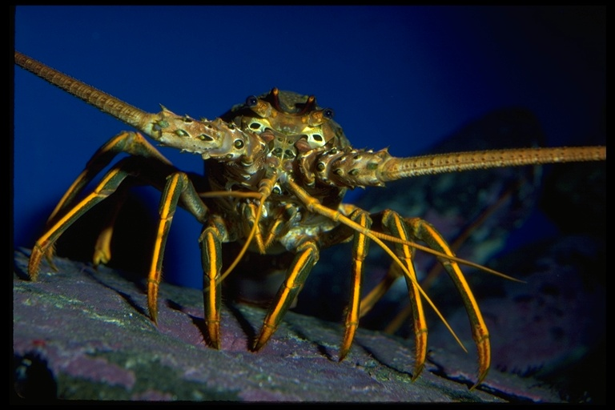
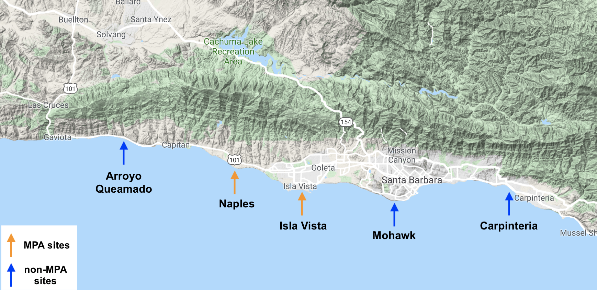

```{r setup, include=FALSE}
knitr::opts_chunk$set(echo = FALSE,
                      message = FALSE,
                      warning = FALSE)

library(tidyverse)
library(tidyr)
library(janitor)
library(here)
library(plotly)
library(DT)
library(lubridate)
library(ggridges)
library(knitr)
library(kableExtra)
```

---

### Introduction 

The California spiny lobster (*Panulirus interruptus*) plays a key role in maintaining the health of giant kelp forests. Spiny lobsters forage algae, snails, crabs, and sea urchins, helping regulate species that prey on kelp, in turn sustaining kelp forest ecosystems^[1](https://portal.edirepository.org/nis/mapbrowse?scope=knb-lter-sbc&identifier=77&revision=newest)^. The natural distribution of the spiny lobster ranges from the coast of Santa Barbara, California to the Gulf of Tehuantepec, Mexico^[2](https://scripps.ucsd.edu/zooplanktonguide/species/panulirus-interruptus)^. Unfortunately, spiny lobster populations are threatened by fishing pressures, ultimately inhibiting their ability to grow, both in population size and individual lobster length. In 2012, two sites along the coast of Santa Barbara - Naples and Isla Vista - were established as marine protected areas (MPAs) to preserve spiny lobster populations. Under the Marine Life Protection Act, MPAs aim to preserve the biodiversity of marine life, the ecompassed habitats, and the natural aspects of marine ecosystems^[3](https://www.wildlife.ca.gov/Conservation/Marine/MPAs)^. The designation of MPA sites allows for a comparison of ecosystem health and variability between protected sites and unregulated areas.



Spiny Lobster Image Source^[4](https://calphotos.berkeley.edu/cgi/img_query?enlarge=9092+3191+3541+0006)^

---

### Data and Methods

The spiny lobster abundance and size data was obtained by Santa Barbara Coastal Long Term Ecological Research (SBC LTER). In 2012, researchers at SBC LTER began collecting data on spiny lobster populations at five sites along the coast of Santa Barbara. Sampling data includes abundance, size, and fishing pressure. Lobster counts and lobster size (mm) were recorded by divers in four 300m^2^ lobster transects. This data is collected annually in late summer at each of the five sites along the Santa Barbara Channel^[1](https://portal.edirepository.org/nis/mapbrowse?scope=knb-lter-sbc&identifier=77&revision=newest)^. Lobster size and abundance are two main varibles assessed within this report. 

Spiny lobster abundance and size across all five sites, discerning between MPA protection status, was visually analyzed via histograms and distribution plots. Statistical tests were performed on the data including a Whelch Two Sample t-test with a significance level of p = 0.05. All statistical analyses and figures were prepared using R software version 3.6.1.

MPA sites established in 2012 - Isla Vista and Naples - are represented by orange coloration in all figures throughout this report. Non-MPA sites - Arroyo Quemado, Carpinteria, Mohawk - are indicated with blue coloration.



Site Map Image Source^[1](https://portal.edirepository.org/nis/mapbrowse?scope=knb-lter-sbc&identifier=77&revision=newest)^

---

```{r}
#Read in lobster file + make it tidy

lobster_raw <- read_csv("lobster_abundance_sbc_lter.csv", na = "-99999")

lobster_tidy <- lobster_raw %>% 
  clean_names() %>%
  tidyr::uncount(count) %>% 
  select(year:size_mm)
```

### Results
#### A. Changes in Lobster abundance (counts) by site

The implementation of MPA status on certain study sites in 2012 yielded an observable difference in both lobster size and abundance (Fig. 1). Over the six-year period after MPA designation, the MPA sites - Naples and Isla Vista - exhibited an increase in the number of lobsters counted by researchers. Both sites had relatively low lobster numbers in 2012: Isla Vista was observed to have under 30, while less than 10 lobsters were found at Naples. By 2018, the Naples population had grown by almost 200 lobsters, and Isla Vista, with over 800 counted lobsters, contained highest abundance among the five sites. The non-MPA sites, Arroyo Quemada, Carpinteria, and Mohawk, show varying lobster abundance over the six-year period. Mohawk shows a decrease in abundance after the highest count at the site in 2014. This steady decline in abundance may be due to overharvesting during the peak abundance year and the lobster populations have been unable to recover.

```{r}
# creating dataframe labeling MPA vs nonMPA
lobster_abund <- lobster_tidy %>% 
  mutate(protection = ifelse(site %in% c("IVEE", "NAPL"), "MPA", "non-MPA"))

# Change site variable names from abreviations to full spelling
lobster_abund$site <- gsub("IVEE", "Isla Vista", lobster_abund$site)
lobster_abund$site <- gsub("NAPL", "Naples", lobster_abund$site)
lobster_abund$site <- gsub("AQUE", "Arroyo Quemado", lobster_abund$site)
lobster_abund$site <- gsub("CARP", "Carpinteria", lobster_abund$site)
lobster_abund$site <- gsub("MOHK", "Mohawk", lobster_abund$site)

```

```{r}
# Making site abundance graph

site_abundance_graph <- ggplot(lobster_abund, aes(x = year))+
  geom_histogram(binwidth = 1,
                 aes(fill = protection),
                 show.legend = FALSE) +
  scale_fill_manual(values = c("#E69F00", "#56B4E9"))+
  facet_wrap(~site) +
  scale_x_continuous(limits = c(2011, 2019),
                     expand = c(0,0),
                     breaks = c(2012, 2014, 2016, 2018))+
  theme_light() +
  labs(x = "Year",
       y = "Lobster Count (n)",
       title = "Figure 1: Lobster Abundance Across Five Sites", 
       caption = "Figure 1 depicts the lobster abundance at each of the five sites.")

site_abundance_graph

```

---

#### B. Differences in lobster size distribution from 2012 to 2018

In 2012, when Naples and Isla Vista were designated as MPAs, the sites exhibited a relatively smaller distribution of lobster size. However, data from 2018 indicates that the populations at MPA sites shifted towards larger lobsters. Non-MPA sites show minimal change in the distrubution of lobster sizes over the six-year period. In fact, by 2018 the average lobster size at Naples and Isla Vista were 7.5% and 10.6% higher than in 2012 respectively. In comparison, mean lobster size at non-MPA sites only increased by 0.1-0.6% during the six-year-period. Figure 2 represents the shifts in the distribution of lobster size. The peaks indicate large quantities of small lobsters at MPA sites in 2012 as opposed to more sizable counts of larger lobsters at the same sites in 2018. In accordance with numerical results, the visual distributions of lobster size at non-MPA sites shows little variance between the two years. An increase in lobster size can be attributed to the designation of this area as an MPA, allowing for lobsters to mature without being harvested.

```{r}

lobster_12_18 <- lobster_tidy %>% 
  filter(year %in% c(2012, 2018))

lobster_all <- lobster_abund %>% 
  filter(year %in% c(2012, 2018))

lobster_size <- lobster_12_18 %>% 
  select(year, site, size_mm)

# Change site variable names from abreviations to full spelling
lobster_size$site <- gsub("IVEE", "Isla Vista", lobster_size$site)
lobster_size$site <- gsub("NAPL", "Naples", lobster_size$site)
lobster_size$site <- gsub("AQUE", "Arroyo Quemado", lobster_size$site)
lobster_size$site <- gsub("CARP", "Carpinteria", lobster_size$site)
lobster_size$site <- gsub("MOHK", "Mohawk", lobster_size$site)

```

```{r}
size_avg <- lobster_all %>% 
  group_by(site, year) %>% 
  summarise(median = median(size_mm),
            mean = mean(size_mm))

# Creating a graph to compare lobsters sizes in 2012 vs. 2018 

size_dist_by_site <- ggplot(lobster_all, aes(x = size_mm, y = site)) +
  geom_density_ridges(aes(fill = protection),
                      show.legend = FALSE)+
  scale_fill_manual(values = c("#E69F00", "#56B4E9")) +
  facet_wrap(~year) +
  scale_x_continuous(limits = c(30, 135),
                     expand = c(0,0)) +
  theme_minimal()+
  labs(x = "Lobster Size (mm)",
       y = "Research Site",
       title = "Figure 2: Lobster Size Across Sites",
       caption = "Figure 2 illustrates the difference in lobsters size between 2012 and 2018 at all five sites.")

size_dist_by_site
```

---

#### C. Comparing mean lobster size at MPA vs. non-MPA sites in 2012 and 2018 

```{r}
# For each year (2012 and 2018) consolidate the size observations into only two groups: MPA and non-MPA lobsters.

# Manipulate df to indicate MPA or non-MPA status. Filter df to include only 2012 + 2018 observations.

lobster_protection <- lobster_tidy %>% 
  mutate(protection = ifelse(site %in% c("IVEE", "NAPL"), "MPA", "non-MPA")) %>% 
  filter(year == c(2012, 2018)) %>% 
  select("year", "site", "size_mm", "protection")

#### wrangling to summarize mean of each 4 groups 

# MPA 2018
lobster_mean_MPA_2018 <- lobster_protection %>% 
  filter(year == 2018, protection == "MPA") %>% 
  group_by(site) %>% 
  summarize(mean_size = mean(size_mm))

#nonMPA 2018 
lobster_mean_nonMPA_2018 <- lobster_protection %>% 
  filter(year == 2018, protection == "non-MPA") %>% 
  group_by(site) %>% 
  summarize(mean_size = mean(size_mm))

# MPA 2012
lobster_mean_MPA_2012 <- lobster_protection %>% 
  filter(year == 2012,
         protection == "MPA") %>% 
  group_by(site) %>% 
  summarize(mean_size = mean(size_mm))

#nonMPA 2012
lobster_mean_nonMPA_2012 <- lobster_protection %>% 
  filter(year == 2012,
         protection == "non-MPA") %>% 
  group_by(site) %>% 
  summarize(mean_size = mean(size_mm))

#### grouped by protection df's 
lobster_mean_12 <- lobster_protection %>%
  filter(year == 2012) %>% 
  group_by(protection) %>% 
  summarize(mean_size = mean(size_mm))

lobster_mean_18 <- lobster_protection %>%
  filter(year == 2018) %>% 
  group_by(protection) %>% 
  summarize(mean_size = mean(size_mm))


```


```{r}
# Creating a date frame with stats to make table
# include: avg, std dev & sample size for MPa and nonMPA 2012 and 2018 
mpa_stats <- lobster_protection %>%
  group_by(year, protection) %>% 
  summarize(
    mean_size = round(mean(size_mm, na.rm = TRUE), 2),
    standard_dev = round(sd(size_mm, na.rm = TRUE), 2),
    sample_size = n())

# Create a finalized table (static) that includes means, standard deviations, and sample sizes for the two groups (MPA and non-MPA sites) in 2012 and 2018. Add a caption above the table.

mpa_stats_table <- mpa_stats %>% 
  kable(col.names = c("Year",
                      "Protection Status",
                      "Mean Lobster Size (mm)",
                      "Standard Deviation",
                      "Sample Size (n)"),
        caption = "Table 1. Summary statistics for MPA and non-MPA sites in 2012 and 2018. The table shows year, protection status, mean lobster size (mm), standard deviation, and sample size (n).") %>% 
  kable_styling("striped") %>% 
  row_spec(c(1,3), color = "white", background = "#E69F00") %>%
  row_spec(c(2,4), color = "white", background = "#56B4E9")

mpa_stats_table
```

```{r}
# Creating data frames to test for a significant difference in lobster size between MPA and non-MPA sites in 2012.
MPA_2012 <- lobster_protection %>% 
  filter(year == 2012,
         protection == "MPA")

nonMPA_2012 <- lobster_protection %>% 
  filter(year == 2012,
         protection == "non-MPA")

protection_2012 <- t.test(MPA_2012$size_mm, nonMPA_2012$size_mm)
```

There was a significant difference in mean lobster size between MPA and non-MPA sites in the year 2012. Table 1 shows a mean lobster size that is 10.18 mm greater at non-MPA sites and a slightly higher standard deviation, indicating larger lobsters at these sites. However, a much smaller number of lobsters were observed at recently designated MPA sites, which could result in a misrepresentation of the population mean and variance. Figure 3 depicts a smaller mean and a bi-modal distribution containing smaller sized lobsters at MPA sites in 2012.  Mean size (mm) for MPA sites (`r round(protection_2012$estimate[1],2)`) and non-MPA sites (`r round(protection_2012$estimate[2],2)`) in the year 2012 differ significantly (t(`r round(protection_2012$parameter,2)`) = (`r round(protection_2012$statistic,2)`, *p* = (`r round(protection_2012$p.value,3)`)).

```{r}
# Creating data frames to test for a significant difference in lobster size between MPA and non-MPA sites in 2018.

MPA_2018 <- lobster_protection %>% 
  filter(year == 2018, 
         protection == "MPA")

nonMPA_2018 <- lobster_protection %>% 
  filter(year == 2018, 
         protection == "non-MPA")

protection_2018 <- t.test(MPA_2018$size_mm, nonMPA_2018$size_mm)
```

Mean lobster size at MPA sites had surpased that of non-MPA by 2018. Table 1 describes a 3.88 mm larger means lobster size at MPA sites compared to non-MPA sites. Six-years post designation of the two MPA sites, observations were collected from sufficiently large sample sizes. Sufficent sample size results in lower variance between samples, ultimately allowing for less uncertainty in the data statistics. Figure 3 shows the higher mean lobster size at MPA sites and right-skewed distribution due to a higher number of larger sized lobsters. Mean size (mm) for 2018 MPA sites (`r round(protection_2018$estimate[1],2)`) and non-MPA sites (`r round(protection_2018$estimate[2],2)`) in the year differ significantly (t(`r round(protection_2018$parameter,2)`) = (`r round(protection_2018$statistic,2)`, *p* = (`r round(protection_2018$p.value,7)`)).

```{r}
# Creating data frames to test for a significant difference in lobster size at MPA sites between the years 2012 and 2018.

MPA_all_2012 <- lobster_protection %>% 
  filter(year == 2012,
         protection == "MPA")

MPA_all_2018 <- lobster_protection %>% 
  filter(year == 2018,
         protection == "MPA")

protection_MPA_all <- t.test(MPA_all_2012$size_mm, MPA_all_2018$size_mm)
```

In 2012, MPA sites were newly established and thus the data from this collection is indicative of conditions prior to protection. By 2018, lobsters at MPA sites had been under protection for six years. This time allowed for an increase in mean lobster size and abundance. Table 1 displays a 12.1 mm increase in mean size (from 65.69 mm to 77.79 mm), and 607 more lobsters observed. Figure 3 depicts this increase in MPA mean lobster size and the corresponding shift in distribution toward larger lobsters. Mean size (mm) for 2012 MPA sites (`r round(protection_MPA_all$estimate[1],2)`) and 2018 MPA sites (`r round(protection_MPA_all$estimate[2],2)`) differ significantly (t(`r round(protection_MPA_all$parameter,2)`) = (`r round(protection_MPA_all$statistic,2)`, *p* = (`r round(protection_MPA_all$p.value,4)`).

```{r}

nonMPA_all_2012 <- lobster_protection %>% 
  filter(year == 2012,
         protection == "non-MPA")

nonMPA_all_2018 <- lobster_protection %>% 
  filter(year == 2018,
         protection == "non-MPA")

protection_nonMPA_all <- t.test(nonMPA_all_2012$size_mm, nonMPA_all_2018$size_mm)
```

Non-MPA sites have not experience any change in terms of regulation. This is demonstrated by only a slight decrease in lobster size and a low increase in sample size compared to that of MPA sites. A decrease in mean lobster size of 1.96mm is shown in Table 1. Figure 3 depicts less variance from the mean lobster size at non-MPA sites in 2018. Mean size (mm) for 2012 non-MPA sites (`r round(protection_nonMPA_all$estimate[1],2)`) and 2018 non-MPA sites (`r round(protection_nonMPA_all$estimate[2],2)`) do not differ significantly (t(`r round(protection_nonMPA_all$parameter,2)`) = (`r round(protection_nonMPA_all$statistic,2)`, *p* = (`r round(protection_nonMPA_all$p.value,2)`).

The data indicates that the designation of MPA sites allowed for the successfull reestablishment of lobster populations at protected sites in the six years following implemented regulations. The lack of change among non-MPA sites confirms the beneficial impacts of regulation on areas containing vulnerable species. Figure 3 highlights the potential improvement that can arise from MPA status. At MPA sites there is a general trend in distribution moving towards larger lobster size and an increase in population size. As a result of static conditions at non-MPA sites, the mean lobster size at MPA sites surpassed that of the unprotected non-MPA sites.

```{r}
# Representation of mean between MPA and non-MPA in 2018.

status_all <- lobster_protection %>% 
  filter(year %in% c(2012:2018)) %>% 
  group_by(year, protection) %>% 
  mutate(size_avg = mean(size_mm))

lobster_distrib <- ggplot(status_all, aes(size_mm, fill = protection))+
  geom_density(alpha=0.35) +
  scale_x_continuous(limits = c(30,200)) +
  scale_fill_manual(values = c("#E69F00", "#56B4E9"))+
  geom_vline(aes(xintercept=size_avg,
                 color = protection),
             linetype = "dashed") +
  facet_wrap(~year) +
  labs(x = "Lobster Size (mm)",
       y = "Lobster Density",
       title = "Figure 3: Change Lobster Size from 2012 to 2018",
       caption = "Figure 3 highlights the change in distribution among MPA and non-MPA sites between the years\n 2012 and 2018. The population means for all four distribution curves is indicated by a dashed line.") +
  theme_minimal()

lobster_distrib
```

---

### Summary

Sites that remained non-MPA status exhibited little change in lobster conditions. From 2012 to 2018,  non-MPA sites remained stagnant with negligent differences in mean lobster size and sample size, as indicated by Table 1. 

The designation of MPA sites in 2012 allowed for a significant increase in lobster abundance in protected areas. The steady growth of lobster populations within MPA sites is depicted in Figure 1.

Additionally, MPA status allowed for a shift in lobsters population toward a higher density of lobsters exhibiting larger size. Figure 2 highlights the diametric shift in the distribution of lobster size at MPA sites.

Mean lobster size increased at MPA sites between 2012 and 2018, ultimately surpasing the mean lobster size at non-MPA sites. The dotted lines in Figure 3 represent a higher mean lobster size at non-MPA sites in 2012. The dotted lines have shifted in 2018 to show that mean lobster size is greater at MPA sites.

A lack of change in lobster abundance and size at non-MPA sites constrasted by significant improvement at MPA sites indicates the advantage that Santa Barbara spiny lobster populations received from implemented regulations.

### References: 
1. Reed D. 2019. SBC LTER: Reef: Abundance, size and fishing effort for California Spiny Lobster (Panulirus interrupts), ongoing since 2012. Environmental Data Initiative. https://doi.org/10.6073/pasta/a593a675d644fdefb736750b291579a0. Dataset accessed 11/14/2019.

2. “Panulirus Interruptus.” *Zooplankton Guide*, Scripps Oceanography, https://www.scripps.ucsd.edu/zooplanktonguide/species/panulirus-interruptus.

3. “California Marine Protected Areas (MPAs).” California Marine Protected Areas (MPAs), California Department of Fish and Wildlife, 2019, https://www.wildlife.ca.gov/Conservation/Marine/MPAs.

4. "Panulirus interruptus; California Spiny Lobster." CalPhotos, University of California, Berkeley, 1999, https://calphotos.berkeley.edu/cgi/img_query?enlarge=9092+3191+3541+0006
